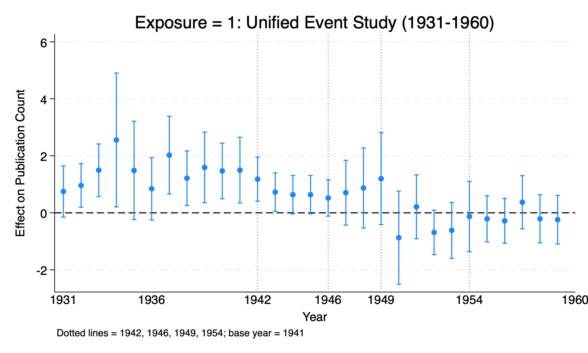

# Political Shocks and Scientific Network Productivity
### Evidence from the Oppenheimer Affair

**Yiqing Zhang** · Economics Honors Thesis, University of Wisconsin–Madison
Advisor: Prof. Christopher Taber
Status: In progress — full thesis due May 2027 · *last updated August 2026*

---

This repository contains the data, code, and analysis for my undergraduate economics
honors thesis. This page is a summary; each section links to a detailed write-up for
readers who want the full treatment.

> **Repository branches.** This `main` branch is the presentable overview. Active
> development lives on
> [`v3-unified-event-study`](https://github.com/bzhang537-creator/Oppenheimer-Honor-Thesis/tree/v3-unified-event-study)
> (unified event study, Dispatch/PROLA data) — the version described throughout these
> pages. Two earlier branches are retained only as history and are no longer maintained:
> [`v1-crossref`](https://github.com/bzhang537-creator/Oppenheimer-Honor-Thesis/tree/v1-crossref)
> (early Crossref data) and
> [`v2-prola`](https://github.com/bzhang537-creator/Oppenheimer-Honor-Thesis/tree/v2-prola)
> (PROLA data, separate difference-in-differences design).

## The Question

Between 1942 and 1954, J. Robert Oppenheimer absorbed three political shocks: recruitment
to lead the Manhattan Project (1942), the Soviet atomic test that reframed him as a security
concern (1949), and the revocation of his security clearance (1954). This thesis asks whether
those shocks propagated through Oppenheimer's **co-authorship network** and suppressed the
publication output of the physicists connected to him.

I assemble a physicist-year panel of *Physical Review* publications (1931–1960) across three
concentric exposure tiers plus a control group, and estimate a **unified event study** to trace
how each shock moved productivity over time.

→ [**Full question & motivation**](docs/01_overview.md)

## Headline Finding

The 1949 suppression **attenuates monotonically with network distance** from Oppenheimer —
the thesis's central result:

| Exposure tier | 1949–53 level effect | *p* | Clusters |
|---|---|---|---|
| **E1** — 11 direct co-authors | **−1.598** | 0.002 | 36 |
| **E2** — 107 co-authors-of-co-authors | **−1.385** | 0.000 | 128 |
| **E3** — 85 IAS Princeton physicists | **−1.079** | 0.003 | 109 |

Direct collaborators are hit hardest; the effect fades with each step outward through the
network. A second key fact: for the innermost tier there is **no recovery at 1946** after the
wartime dip — output stays depressed and deepens through the political era, which distinguishes
a genuine political channel from simple wartime incapacitation.

<!-- Replace with your exported E1 coefplot -->

→ [**Results in detail (E1, E2, E3)**](docs/03_results.md)

## What's in this repository

| Section | Summary | Detail |
|---|---|---|
| Overview & motivation | The three shocks, the network hypothesis, the three questions | [docs/01_overview.md](docs/01_overview.md) |
| Data | Five groups, sources, coverage, construction | [docs/02_data.md](docs/02_data.md) |
| Results | Unified event study across E1/E2/E3, monotone attenuation | [docs/03_results.md](docs/03_results.md) |
| Methods | Unified event-study design, 1941 base-year fix | [docs/04_methods.md](docs/04_methods.md) |
| Robustness | Treated-specific trends, wild-cluster bootstrap, 1954 artifact | [docs/05_robustness.md](docs/05_robustness.md) |
| Manhattan benchmark | Pure-incapacitation reference & channel decomposition | [docs/06_benchmark.md](docs/06_benchmark.md) |
| Open questions | The control-group problem and next steps | [docs/07_open_questions.md](docs/07_open_questions.md) |
| Reproduction | Dependencies, paths, run order, do-file map | [docs/08_reproduction.md](docs/08_reproduction.md) |

The Manhattan benchmark's underlying physicist-level publication data is documented separately in
[`manhattan_project_summary.md`](manhattan_project_summary.md).

## Status & Scope

This is an undergraduate honors thesis in progress (ECON 681/682), not a field paper. The
full thesis is expected May 2027. The current open methodological question concerns the control
group — see [docs/07_open_questions.md](docs/07_open_questions.md).
