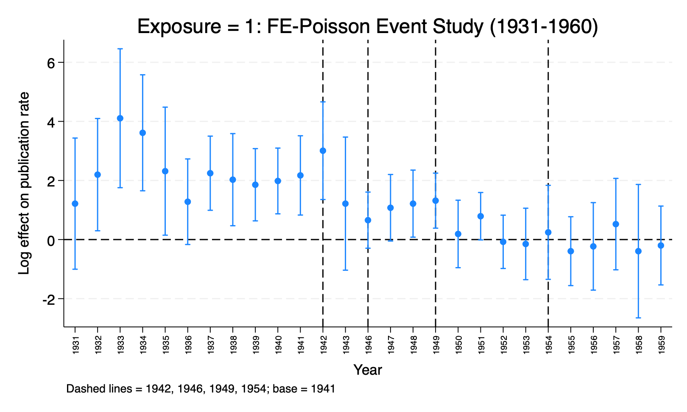

# Robustness: Identification & Inference

[← back to README](../README.md)

## Treated-specific linear trend

To check whether the results are an artifact of smooth differential drift, each level is re-estimated
adding a treated-specific linear trend, $\text{treated} \times (\text{year} - 1941)$, which absorbs
any smooth divergence between treated and control.

| Level | Trend coefficient | *p* | Effect on headline |
|---|---|---|---|
| **E1** | 0.002 | 0.96 | level effects essentially unchanged |
| **E2** | −0.005 | 0.83 | effects unchanged |
| **E3** | −0.030 | 0.024 (sig.) | post49T shrinks −1.08 → −0.74, still sig. (*p* = 0.016) |

**Reading.** For E1 and E2 the trend is null, so the pre-trend rejection at E1 is driven by
idiosyncratic late-1930s variation, not a linear trend. For E3 the full-sample trend is significant
and partly absorbs the treatment itself; because the E3 *pre-period* test is clean (*p* = 0.27), the
trend-adjusted −0.74 is reported as a **conservative bound**, leading with the clean pre-period test.
Modest shrinkage at the most distant tier is expected.

## The E1 pre-trend defense

E1 is the only tier whose pre-trend rejects. The defense has three parts:

1. **Direction.** The pre-trend is *positive*, so it biases the estimated (negative) effects toward
   zero. The reported effects are therefore conservative.
2. **Shape.** It is driven by idiosyncratic late-1930s spikes, not a smooth drift into 1942.
3. **Timing.** A smooth trend cannot produce the sharp break at 1949. Identification rests on the
   timing of the breaks — the sharp kink at 1949 and the failure to recover at 1946.

## FE-Poisson (count model)

Publication counts are nonnegative integers, so the linear model is re-estimated as a
fixed-effects Poisson (`ppmlhdfe`), following Azoulay, Graff Zivin & Wang (2010). This checks
whether the pattern is an artifact of the level scale and respects the count support.

*E1 FE-Poisson event study (log publication rate, base 1941).* The same monotone deepening after
1949 appears, expressed as a declining publication rate. The pre-trend persists under Poisson
(χ²(10) = 58.09, *p* < 0.001), confirming it is a real feature rather than a linear-scale artifact —
which is why it is defended above rather than explained away. Poisson drops the 1944–45 wartime
years by separation (zero treated publications), so those markers are absent from the plot.

## Wild-cluster bootstrap

With only 36 clusters, E1's cluster-robust SEs may be biased downward. Wild-cluster bootstrap
*p*-values (Cameron, Gelbach & Miller 2008; 9,999 replications) confirm the headline effects.

| Coefficient | Analytic *p* | Bootstrap *p* | Bootstrap 95% CI |
|---|---|---|---|
| E1 post49T | 0.003 | 0.004 | [−1.39, −0.31] |
| E1 post54T | 0.900 | 0.898 | [−0.85, 0.91] |
| E3 post49T | 0.003 | 0.002 | [−1.83, −0.34] |

The bootstrap nudges *p*-values slightly upward, as small-cluster theory predicts, but overturns no
conclusion. E2 and E3 (128 and 109 clusters) are above the usual small-cluster threshold, so their
bootstrap is confirmatory.

## The 1954 control-group artifact

The positive incremental 1954 coefficient at all three tiers is a control-group artifact. Dropping
three controls with post-1950 career transitions unrelated to Oppenheimer (Seitz, Shockley, Townes)
removes it while leaving the 1949 effect essentially unchanged. See [Results](03_results.md#the-1954-positive-coefficient-is-a-control-group-artifact)
for the E3 numbers.

---

Related: [Results](03_results.md) · [Methods](04_methods.md) · [Open questions](07_open_questions.md)
